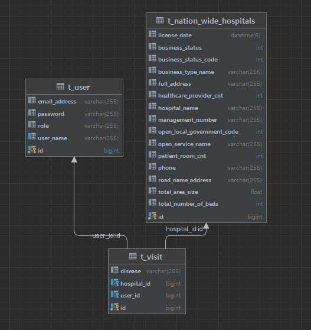

# 전국 병의원 데이터 게시판 프로젝트
[배포주소](http://ec2-15-164-233-75.ap-northeast-2.compute.amazonaws.com:8080/articles/list)
***

## ERD

***

## 개발 환경
- Java 11
- SpringBoot 2.7.5
- Spring Security
- Gradle
- MySQL
- JPA
- mustache
- AWS EC2
- Docker

***

## 구현 기능

-[X] [회원가입, 로그인]
  - 회원 가입한 회원의 비밀번호를 `BCryptPasswordEncoder`를 통해 암호화 후 DB에 저장
-[X] [병의원 데이터 조회]
  - 전국 병의원 데이터 CSV 파일을 파싱 후 DB에 저장
  - 전국 약 12만개의 병의원 데이터 조회
- [X] [게시판 작성 및 조회]
  - 회원가입 된 ID와 비밀번호로 게시글 작성
  - 작성된 게시글 수정

***

## 참조
### 병의원 데이터 출처
<https://www.localdata.go.kr/devcenter/dataDown.do?menuNo=20001>